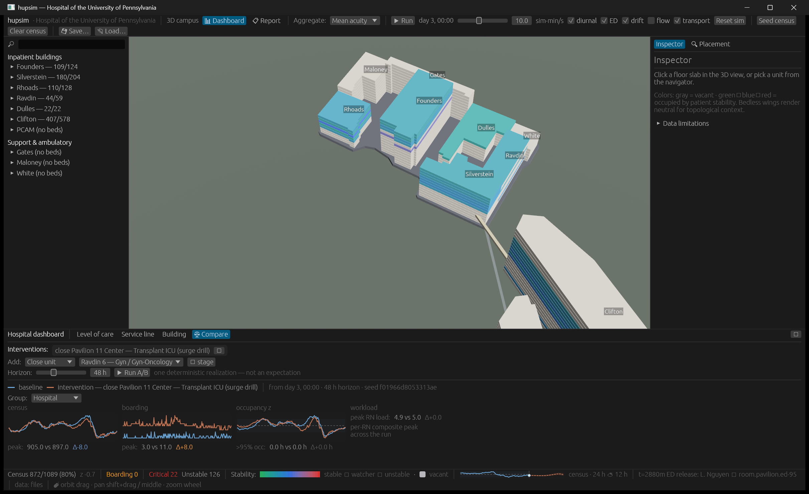

# Surge experiments: an ICU closure, an arrival wave, and a staffing flex

*Three A/B what-if runs against the same live hospital state show that bed
capacity, occupancy saturation, and nursing workload fail in distinguishable
ways — and that a deterministic one-realization-per-arm design buys perfect
attribution at the cost of any distribution over outcomes.*

## Question

A capacity manager staring at a ~85% house wants to know three things
before a bad day arrives. If the largest ICU goes offline for two days, where
do its patients pool and what happens to the rest of the critical-care layer?
If a 40-admission med-surg wave hits over an afternoon, does the house absorb
it, and what does "absorb" cost? And if the busiest med-surg unit flexes its
nurse ratio, does that relieve anything a bed count can see? These are the
questions the EP-15 experiment machinery was built to stage, and this study
runs all three against the same starting state.

## Data & methods

All parameters in this model are synthetic-but-shaped: plausible
professional-norm values in visible tables, not measurements of the real
Hospital of the University of Pennsylvania, and no real patient data exists
anywhere in the project. The building and unit structure the experiments run
against, by contrast, is real-world-sourced with per-entry confidence tags.
One naming note for the tables below: the building publicly called the
Pavilion (3400 Civic Center) is named **Clifton** in this model, though unit
display names still print "Pavilion 11 Center" and the like.

The world is the full compiled hospital seeded with the demo census at seed
`0xC0FFEE`, with admission timestamps backdated so standing patients carry
realistic elapsed stays, then warmed 24 sim-hours under the complete realism
stack — standing-census exits, acuity drift, diurnal flow, ED pressure — at
15-minute ticks. That is exactly the state a live operator would launch
experiments from. Each experiment then runs through the EP-15 A/B machinery
at seed `0xEB15`: both arms clone the same world, seed identical engines,
pre-warm workload z-score norms from the live run, schedule residual-LOS
exits for every patient in-house (identically in both arms), and tick a 48 h
horizon. Every difference between arms is therefore attributable to the
staged intervention — but each arm is ONE deterministic realization, not an
expectation. No confidence intervals exist by design. That trade buys perfect
attribution and exact replayability; it costs any distribution over outcomes,
which means deltas smaller than run-to-run wobble are not attributable. The
stepdown result in Experiment 1 below is the worked example of that caveat.

**Provenance.** Unit rosters, bed counts, and campus geometry are OSINT-
sourced and confidence-tagged (verified/reported/inferred/unverified);
arrival rates, length-of-stay distributions, acuity dynamics, and staffing
ratios are synthetic-but-shaped values from the visible parameter tables.
Every number in the Results section is machine output from the harness run
below or an arithmetic derivation shown inline.

**Reproduction.**

```
cargo test -p hupsim-app --test surge_analysis -- --nocapture
```

World seed `0xC0FFEE`, experiment seed `0xEB15`, at the EP-18 commit recorded
in [`roadmap/README.md`](../../../roadmap/README.md). The harness mirrors `compare_smoke`'s warmed world and
unit selection (the logic is duplicated across the two tests, kept aligned by
review).

## Results

### Experiment 1 — close Pavilion 11 Center (Transplant ICU) for 48 h

Staging tells the first half of the story before a single tick runs: 10 of
the unit's beds went out of service (every vacant bed, plus each bed vacated
by a successful evacuation), and only 4 of the unit's 15 occupants
(4 evacuated + 11 stranded = 15) found a same-level-of-care bed elsewhere in
the house. The remaining 11 were stranded in place and flagged as boarding.
At a ~85% house, ICU slack is measured in single beds — the binding
constraint revealed itself at staging time.

| Metric (hospital-wide)  | Baseline | Variant | Delta |
|-------------------------|---------:|--------:|------:|
| Peak census             | 935      | 934     | -1    |
| Peak boarding           | 3        | 13      | +10   |
| Hours > 95% occupancy   | 0.0      | 0.0     | +0.0  |
| Peak per-RN workload    | 5.56     | 5.29    | -0.27 |

| Level of care | Peak boarding (base → var) | Hours > 95% occ (base → var) |
|---------------|---------------------------:|-----------------------------:|
| ICU           | 0 → 11 (peak at t+0 h)     | 16.8 → 48.0                  |
| Emergency     | 3 → 3 (peak at t+17 h)     | —                            |
| Med/Surg      | —                          | 5.5 → 7.2                    |
| Stepdown      | —                          | 38.8 → 34.0                  |

ICU boarding peaks at t+0 h because the 11 strands *are* the boarding. ICU
hours above 95% occupancy go from 16.8 to 48.0 — the entire horizon: with
the whole unit out of the pool, the surviving ICU capacity is pinned at
saturation for two days straight.

Two results deserve honest handling rather than a causal story. First,
hospital peak workload *fell*, 5.56 → 5.29. The peak-workload series is a
max statistic over unit rosters, sensitive to exactly who lands where and to
ceil-allocation granularity; this is the kind of composite-metric artifact a
real dashboard would need to defend against, not evidence that closing an
ICU eases nursing load. Second, stepdown hours above 95% moved 38.8 → 34.0 —
the wrong direction for a pure constraint story. Once the arms diverge, the
downstream RNG draw pattern diverges too, and a delta of this scale sits
within single-realization wobble. This is the promised worked example: with
one realization per arm, a difference this small is not attributable.

### Experiment 2 — +40 med-surg admissions over 6 h (from t+2 h)

All 40 admissions were placed; 0 remained unplaced at run end. The house had
the bed headroom. What it did not have was slack.

| Metric                  | Hospital (base → var, Δ)  | Med-surg only (base → var, Δ) |
|-------------------------|---------------------------|-------------------------------|
| Peak census             | 935 → 972 (+37)           | 689 → 715 (+26)               |
| Peak boarding           | 3 → 7 (+4)                | 0 → 0 (+0)                    |
| Hours > 95% occupancy   | 0.0 → 0.0 (+0.0)          | 5.5 → 39.0 (+33.5)            |
| Peak per-RN workload    | 5.56 → 5.55 (-0.01)       | 3.50 → 3.58 (+0.08)           |

Occupancy saturation and boarding are different failure signatures. The wave
produced no med-surg boarding at all, yet med-surg hours above 95% occupancy
rose from 5.5 to 39.0 (+33.5 h) — the med-surg layer runs saturated for most
of two days. A wave the bed count can technically absorb still consumes the
surge-capacity slack that would have cushioned the *next* event. And this is
the gentlest possible version of a 40-admission shock: the model's wave is
even-paced and first-fit-placed, whereas real mass-casualty arrivals cluster
in time, require triage, and are not all med-surg. The forecast-calibration
study ([04](04-forecast-calibration.md)) shows the same scenario from the
other side: a 40-admission injection is exactly the shock that escapes the
forecast's 10–90 band within about 4 hours.

### Experiment 3 — flex Silverstein 9 (Pulmonology) to 2.0 pts/RN

| Metric (flexed unit)    | Baseline | Variant | Delta |
|-------------------------|---------:|--------:|------:|
| Peak census             | 35       | 35      | +0    |
| Peak boarding           | 0        | 0       | +0    |
| Hours > 95% occupancy   | 34.0     | 34.0    | +0.0  |
| Peak per-RN workload    | 3.28     | 2.63    | -0.65 |

Peak per-RN workload drops 3.28 → 2.63 (0.65/3.28 ≈ 20%), and the harness
asserts the census series is bit-identical between arms — the boarding line
and the occupancy summary come out identical as well. This is by
construction: staffing is a workload lever, never bed physics. The model refuses to let a staffing knob quietly "fix" a capacity
problem — the two failure modes stay orthogonal on purpose.



*The in-app Compare tab with the same Pavilion 11 Center closure staged and
run from day 3 00:00 at the app's decorrelated in-app seed (visible
in-frame), 48 h horizon; peak boarding 3.0 vs 11.0 (delta +8.0) there. The
in-app run starts from a different world moment with a different
(decorrelated) seed than the headless harness, so its numbers legitimately
differ from the tables above; the screenshot documents the workflow, the
harness documents the numbers. Captured at the EP-18 commit, app seed
0xC0FFEE.*

## Assumptions & limitations

- **One realization per arm, no confidence intervals.** Every delta above is
  exact for this seed pair and unknown in distribution. Small deltas (the
  stepdown 38.8 → 34.0 move) are not attributable to the intervention. A
  Monte-Carlo ensemble over seeds is future work (see the capstone study).
  Direction of bias: overstates the precision of small effects; the large
  effects (ICU saturation, +33.5 med-surg hours) are far outside plausible
  wobble.
- **Arrivals are exogenous.** No diversion, no EMS re-routing, no turn-away:
  saturation never feeds back into demand. A real hospital at 48 h of ICU
  saturation would shed demand; the model cannot, so sustained-saturation
  results overstate how long the pressure would actually persist.
- **First-fit placement is not clinical triage.** The wave lands wherever a
  compatible bed exists first, which understates placement friction and
  makes the "0 backlog" result an upper bound on absorption capacity.
- **Closure evacuation considers only same-level-of-care beds.** A real
  intensivist would downgrade selected stable patients to stepdown; the
  model's 11-stranded figure is therefore a worst case, biasing the boarding
  delta upward.
- **Length of stay is exogenous.** A crisis does not accelerate discharges
  here, yet expedited discharge is the real hospital's strongest homeostatic
  response. Its absence biases every saturation duration upward.
- **The staffing/physics fence cuts both ways.** The closure experiment does
  not model RN redeployment from the closed unit, so workload readings around
  the closure omit a relief valve real operations would use.

## Operational read

For a capacity committee, three transferable lessons — with the standing
hedge that every dynamic parameter here is synthetic-but-shaped, so the
numbers illustrate mechanics, not HUP's actual operating point.

Take away, first, that ICU contingency planning is a staging problem before
it is a simulation problem: the decisive number (4 evacuable beds against 15
occupants) was known the moment the closure was staged. Second, that
occupancy saturation and boarding must be tracked as separate alarms — a
wave can produce almost no boarding while stripping the med-surg layer of
two days of slack, and a dashboard showing only boarding would call that
event a non-event. Third, that staffing flexes and bed capacity are
different levers; any tool that lets a ratio change move a census curve is
hiding an assumption.

Do not take away any specific magnitude — not the 33.5 hours, not the +10
boarding peak — as a prediction about the real hospital. The parameters are
synthetic, the arms are single realizations, and the strongest real-world
homeostatic responses (demand shedding, expedited discharge, RN
redeployment) are deliberately absent. What survives those caveats is the
shape of the failure modes, not their size.

Part of the [hupsim case-study series](README.md) · Model-wide assumptions
and the road forward: [Model honesty & future
directions](05-model-honesty-and-future-directions.md)
