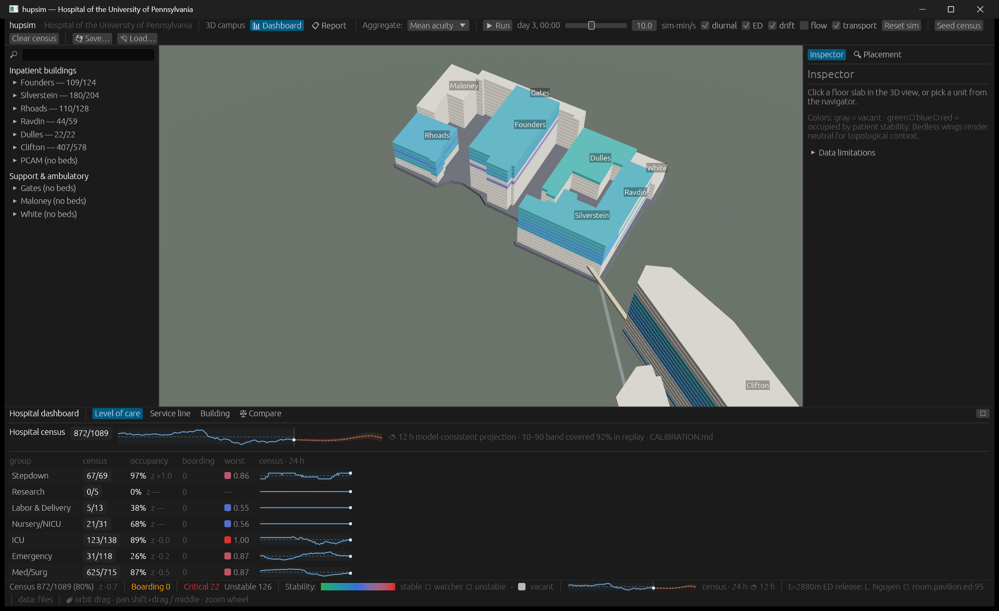

# How good is the census forecast, and how do we know?

*A 12-hour census fan on a ~900-patient synthetic house covered 92% of realized
outcomes in the settled regime, against a nominal 80% band — and the
interesting part is the replay discipline that produced, corrected, and now
pins that number.*

## Question

A bed huddle at 08:00 wants to know where the house will be at 20:00. If a
model draws a fan around tomorrow's census, the operational questions are the
ones a capacity manager would actually ask: how often does reality land inside
the band, how far off is the point forecast in beds, does the error drift in
one direction, and — most importantly — under what conditions does the fan
stop being trustworthy? This study reads the model's own answer to those
questions: the EP-17 calibration replay recorded in the repo's honesty ledger,
[`CALIBRATION.md`](../../CALIBRATION.md).

## Data & methods

One framing sentence first, because it governs everything below: all flow
dynamics in hupsim are synthetic-but-shaped — plausible professional-norm
parameters in visible tables, not measurements of the real HUP — and no real
patient data exists anywhere in the project. The building roster and geometry
are real-world-sourced with per-entry confidence tags; the arrivals,
lengths of stay, and discharge timing the forecast integrates are not.

The forecast under test is the census fan shown in the dashboard drawer: a
pure, RNG-free analytic projection. For each horizon h it computes
census(t+h) = census(t) + net arrivals − expected departures. Net arrivals
integrate the generator's own diurnal arrival-rate tables (hour-of-day shape
times a weekend factor), with future ED arrivals churned back out on the
treat-and-release clock. Expected departures apply the generator's own LOS
log-normals to each standing patient, conditioned on that patient's elapsed
stay (the EP-21 backdated admission stamps), on a clock shifted +12.5 h to
match the discharge-hour curve; ED occupants exit via a disposition posterior
over the two episode distributions. There is no Monte Carlo, no learning, and
— deliberately — no reading of the simulator's event queue, which literally
contains every scheduled discharge. The model is restricted to what a
bed-huddle observer could see: the standing census, elapsed stays, and the
posted rate tables. Uncertainty comes from Poisson arrival variance plus
Poisson-binomial departure variance, expressed as normal 10/50/90 quantiles
clamped at staffed beds.

Calibration is by replay: run the full compiled hospital (1,115 rooms) from a
seeded census at seed 42 for 8 sim-days, issue a forecast every hour (191
issues), and score each against the census the same run later realized —
band coverage, mean absolute error, and bias, by horizon and by regime
segment. The headline number is then pinned: the calibration test fails if
measured regime 12 h coverage drifts more than ±3% from the in-code constant
`FAN_COVERAGE_10_90_PCT`, so the documentation and the constant must be
re-issued together and cannot silently diverge.

One caveat belongs here in the methods, not in the fine print. This is a
closed loop. The forecast integrates the same tables the generator draws
arrivals and stays from. Near-zero bias in that setting is a property of the
loop — it demonstrates the projection mathematics is faithful to its inputs,
not that the method would calibrate against a real hospital, whose rates are
not posted anywhere. The transferable claim is methodological: build the
observer-limited projection, replay it against realized census, publish
coverage/MAE/bias by horizon, and pin the headline with a test.

**Provenance.** The room inventory the replay runs on is the real-world-
sourced roster (verified/reported/inferred/unverified tags per entry, per the
provenance discipline in the workspace README). Every rate, LOS distribution,
discharge-hour weight, and disposition fraction is synthetic-but-shaped. The
calibration table below is a genuine measurement — of the synthetic system
against itself.

**Reproduction.**

```
cargo test -p hupsim-app --test forecast_calibration -- --nocapture
```

Seed 42 replay; the same test is the drift pin. Run at the EP-18 commit
recorded in [`roadmap/README.md`](../../../roadmap/README.md).

## Results

The measured table, quoted verbatim from
[`CALIBRATION.md`](../../CALIBRATION.md) (191 hourly forecast issues over 8
sim-days at seed 42; nominal 10–90 band coverage is 80%):

| segment | horizon | n | 10–90 coverage | MAE (beds) | bias (beds) |
|---|---|---|---|---|---|
| day 1 (settle-in) |  2 h | 23 | 91% | 3.8 | −1.4 |
| day 1 (settle-in) |  6 h | 23 | 78% | 8.0 | −3.1 |
| day 1 (settle-in) | 12 h | 23 | 87% | 8.5 | −4.1 |
| day 1 (settle-in) | 24 h | 23 | 100% | 7.8 | −2.4 |
| days 2–7 (regime) |  2 h | 145 | 92% | 3.2 | −0.5 |
| days 2–7 (regime) |  6 h | 145 | 90% | 5.2 | −0.9 |
| days 2–7 (regime) | 12 h | 145 | **92%** | 6.3 | −1.1 |
| days 2–7 (regime) | 24 h | 145 | 100% | 7.2 | −1.6 |

Headline: in the settled regime the 10–90 band covered 92% of 12 h-ahead
forecasts, MAE stays at or under ~7 beds out to 24 h on a ~900-patient house,
and residual bias is under 2 beds/day. (The two segments account for 23 + 145
= 168 of the 191 issues; the balance are issues too late in the 8-day window
to be scored against realized census at every horizon.)

Coverage sits *above* the nominal 80% for a disclosed reason, not a lucky
one: the band takes arrival variance as Poisson, but the generator thins
arrivals per sub-step with a floor-plus-Bernoulli scheme that is sub-Poisson
at coarse ticks — at the replay's 15-min cadence, roughly a quarter of the
Poisson variance is realized. A band tuned tighter to this replay would score
better here and be less robust across clock speeds, so the conservative
variance stands. The 100% coverage at 24 h is the same effect compounding.

The fan also fails on schedule, and the failures are measured rather than
hypothesized. A 40-admission surge injected at day-3 12:00 — invisible to the
integrated rate tables — escaped the band of the fan issued at 08:00 within
~4.2 h: realized census of 929 beds crossed the 915-bed q90, a 929 − 915 =
14-bed exceedance. The `surge_injection_escapes_the_band` test *asserts* that
miss, so the documented limitation cannot silently go stale if the model
changes. Regime changes (an EP-15 unit closure, a staffing-ratio flex, a
changed admit fraction) sit outside the tables by the same mechanism. Day-1
settle-in is visibly rougher: 6 h coverage dips to 78% with a −3.1 bed bias
while backlog exits and ED adoption transients wash out. Near saturation the
model clamps quantiles at staffed beds but does not queue.

Two corrections from the first draft are kept in the ledger, and they are the
strongest evidence the calibration process works. The initial model
over-forecast by +80 beds/day because it integrated ED arrivals into census
without letting the ~70% treat-and-release share leave again within the
horizon; the fix was thinned-Poisson net arrivals. After that, it
under-forecast by −22 beds/day because departure hazards ran on the raw LOS
tables while the discharge-hour curve delays every exit by ≈12.5 h on
average, making raw hazards ~10% hot; the fix moved the LOS clock onto the
shifted schedule. Both were sign-and-magnitude errors in a model that looked
plausible on inspection, and only the replay-against-realized-census loop
surfaced them.



*Dashboard drawer at sim time day 3 00:00, app seed 0xC0FFEE: blue census
history, gray "now" divider, dashed clay median with shaded 10–90 fan, and
the in-app honesty caption quoting the 92% replay coverage with a pointer to
CALIBRATION.md. Captured at the EP-18 commit.*

## Assumptions & limitations

- **Closed loop, restated as the central limitation.** The ±2 beds/day
  unbiasedness certifies the projection against its own generator, nothing
  more. Against a real hospital the rate tables would themselves be
  estimates, and the bias would inherit their error. Direction: the reported
  bias and MAE are optimistic lower bounds on real-world performance.
- **Hospital-level only.** The fan is one number for the whole house. A
  per-unit or per-group split was deliberately not claimed, because
  vacancy-share bed placement and ED-to-ward transfer coupling are exactly
  the flows this simple model cannot honestly allocate. Direction: unit-level
  questions (which ICU is short at 20:00) are unanswered, not approximately
  answered.
- **No exogenous predictors.** Day-of-week is the only calendar structure —
  no seasonality, weather, epidemics, or scheduled-surgery calendar.
  Direction: any real predictable structure beyond the diurnal/weekly cycle
  would appear as band misses the model cannot anticipate.
- **Surges and regime changes escape by construction** (measured: ~4.2 h to
  band escape for a 40-admission surge). The fan is a baseline, not an
  early-warning system. Direction: exactly when a capacity committee most
  wants a forecast, this one is most wrong.
- **Normal-approximation quantiles clamped at staffed beds, no queueing.**
  Turn-aways and ED diversion near 100% occupancy are not modeled; at the
  ~85% regime the clamp never binds, under surge it does. Direction: the fan
  understates congestion risk precisely in the tail that matters.
- **Deliberately conservative band width** (Poisson variance over a
  sub-Poisson generator). Direction: coverage above nominal at coarse ticks;
  honest coverage would require variance matched to tick size, at the cost of
  robustness across clock speeds.
- **One replay, one seed.** The table is a single seed-42 realization of
  autocorrelated hourly issues, not a distribution over seeds; the coverage
  and MAE values would wobble under re-seeding, and no spread is reported.
  Direction: the quoted percentages carry unstated sampling error — another
  reason to read them as workflow output, not performance claims.

## Operational read

What a capacity committee should take from this study is a workflow, not a
number. The 92% coverage, ~7-bed MAE, and sub-2-bed/day bias describe a
synthetic system agreeing with itself; no operational decision should lean on
those specific values. What transfers is the discipline: a forecast
restricted to observable state (no peeking at scheduled events), scored by
replay against realized census, reported as coverage/MAE/bias by horizon and
regime, with its failure modes demonstrated by injected surges and its
headline claim pinned by a test that fails on ±3% drift. The two shipped-then-
caught errors — ED churn (+80 beds/day) and the discharge-clock shift (−22
beds/day) — are the argument in miniature: plausible-looking census models
carry sign-and-magnitude errors that only a closed scoring loop exposes. A
committee evaluating any census-forecasting product could reasonably demand
exactly this artifact — the replay table, the failure-mode tests, the pinned
headline — before believing a vendor's band.

Part of the [hupsim case-study series](README.md) · Model-wide assumptions
and the road forward: [Model honesty & future
directions](05-model-honesty-and-future-directions.md)
