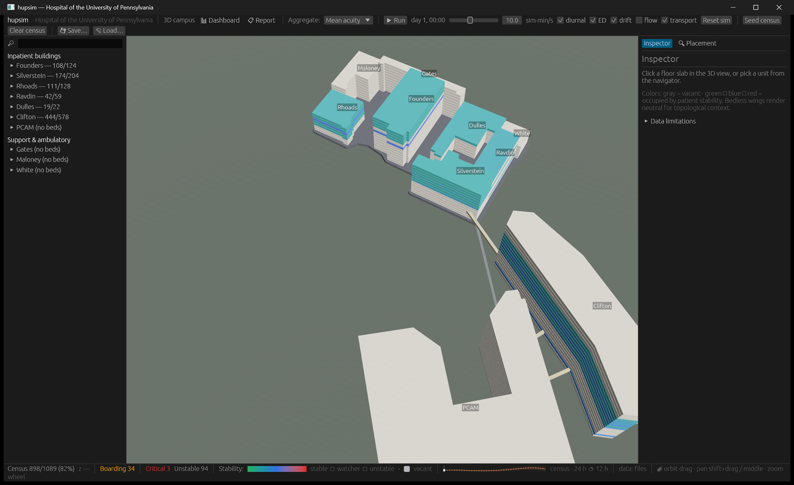

# hupsim case studies

*Reproducible analyses from a room-level model of HUP — what the model can
honestly answer, and what it deliberately does not claim.*

*The compiled campus at t0, seed 0xC0FFEE — 1,115 rooms, 42 units; HUP Main's
eight wings on their shared ground podium, Clifton and PCAM across the street,
the three surveyed skybridge decks. (The status bar's census denominator,
1,089, is staffed beds: the 1,115 modeled rooms less the 26 the seeded
scenario blocks out of service.) Captured at the EP-18 commit.*

*Reproducibility note: the "EP-N commit" references throughout this series point into the
project's private development history, which was not carried into the public repository.
Every seed + command reproduces against the current tree.*

## What this model is for

This series demonstrates a hospitalist-informaticist systems method — capacity,
acuity, boarding, transport topology, staffing load, forecasting — exercised on
a faithfully structured but synthetically parameterized model of a real campus.
The structure (buildings, units, rooms, bridges) is real-world-sourced, with a
per-entry confidence tag on every element; the dynamics (arrivals, lengths of
stay, transport minutes, workloads) are synthetic-but-shaped: plausible
professional-norm values in visible parameter tables, not measurements. Every
number in the series reproduces from a stated seed and command at the EP-18
commit recorded in [`roadmap/README.md`](../../../roadmap/README.md). One naming note applies throughout:
the building the real campus calls the Pavilion appears here as Clifton,
though unit display names still print "Pavilion 7 City" and the like.

## What it deliberately does not claim

- No real patient data exists anywhere in the project — none was collected,
  none was used.
- No claim is made about the real HUP's current operations; the roster is
  OSINT with tagged confidence and visible open questions.
- Minutes, censuses, and workloads throughout are model quantities, not
  measurements of the real hospital.
- The forecast calibration is closed-loop: the forecaster integrates the same
  tables the generator draws from, so good coverage is a property of the loop,
  not evidence the forecast would survive contact with a real hospital.
- A/B experiment results are single deterministic realizations per arm, not
  expectations over runs.
- Demand never reacts to saturation (there is no diversion), and length of
  stay never reacts to pressure.

## The studies

| # | Study | Question it answers | Headline |
|---|-------|---------------------|----------|
| 01 | [ED-to-bed transport](01-ed-to-bed-transport.md) | From the ED, how far away is each tower's nearest bed, and through what topology? | Nearest Clifton bed 4.3 min vs worst HUP Main 15.7 min; all 19 HUP Main routes cross one skybridge |
| 02 | [PCAM and CHPS access](02-skybridge-pcam-chps-access.md) | Are PCAM and CHPS the same destination, and does the unverified tunnel matter? | CHPS is a HUP Main destination at 8.7 min, PCAM a Clifton-side one at 3.1 min; the tunnel would change routes by at most ~0.4 min |
| 03 | [Surge experiments](03-surge-experiments.md) | What breaks first under an ICU closure or an arrival wave? | Closing the largest ICU strands 11 patients — only 4 ICU beds existed to evacuate into; a +40 wave saturates med-surg for 39 h without mass boarding |
| 04 | [Forecast calibration](04-forecast-calibration.md) | Are the census forecast bands honest, and when do they fail? | 92% coverage of 12 h forecasts vs a nominal 80; a 40-admission surge escapes the band in ~4 h |
| 05 | [Model honesty & future directions](05-model-honesty-and-future-directions.md) | What is simplified, and what would extending vs rebuilding cost? | The simplification ledger and the extend-vs-rebuild road map — read this to know what the model is NOT |

## Reproducing

A stock Rust toolchain builds the workspace. Each study's Reproduction block
gives the exact command and seed that regenerate its evidence at the EP-18
commit recorded in [`roadmap/README.md`](../../../roadmap/README.md). The test suite doubles as a set of
pins: funnel census, calibration coverage, and the surge deltas are asserted
in tests, so the claims documented here fail the suite if they drift.

Two conventions used throughout. "EP-N" labels refer to the numbered
endpoint briefs in the project roadmap — one brief per working session, each
recorded with its commit hash in the roadmap README linked above. The
screenshots were captured from the live app at the EP-18 commit, with sim
state advanced headlessly at the 15-minute test cadence and panels staged
open by a temporary QA patch (the roadmap's established practice, reverted
before commit); screenshot numbers are context — the printed tables are the
evidence.

---

Series index for the [hupsim application](../../README.md) — the application
this series documents. Model-wide parameter honesty:
[CALIBRATION.md](../../CALIBRATION.md).
